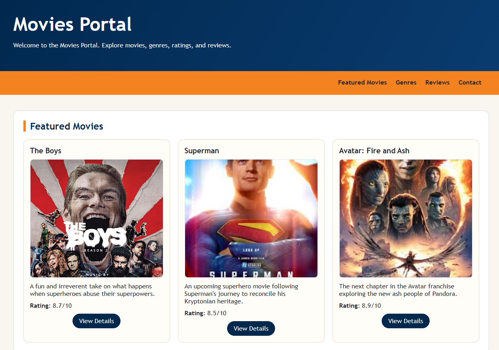
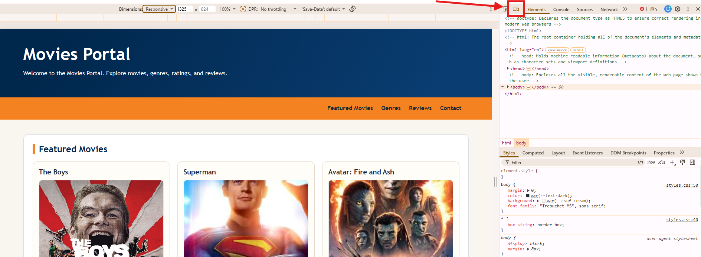
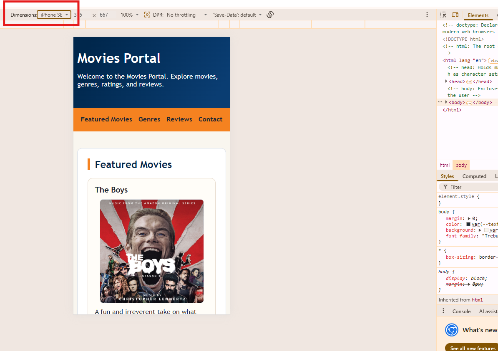
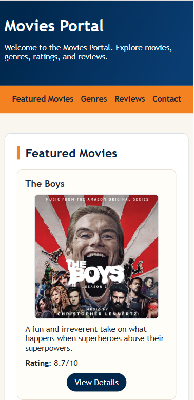
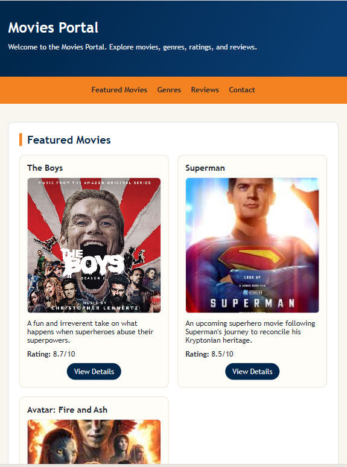

# CPSC-349 Lab 3: Responsive Movies Portal

## Overview

In Lab 3, the focus is responsive design. A responsive webpage changes its layout so it works well on different screen sizes, including desktop computers, tablets, and phones.

In this lab, students will inspect the existing Movies Portal, observe how the layout breaks on a phone-sized screen, uncomment a provided responsive design demo, and then complete a new responsive layout for iPad-sized screens.

This lab practices:

1. Browser DevTools device testing
2. CSS media queries
3. Responsive containers
4. Responsive navigation
5. Responsive movie card grids
6. Testing layouts across desktop, tablet, and phone sizes

---

## Getting Started

1. Open the project in VS Code.
2. Open [index.html](index.html) in a browser by double-clicking the file or by using Live Server.
3. Confirm that the page loads.

Reference starting page:



---

## Inspect the Mobile Layout

1. Open the page in your browser.
2. Right-click the page and choose **Inspect**.



3. In DevTools, choose the responsive/device toolbar.



4. Switch to a phone-sized screen.
5. Notice that the page does not render properly on a phone screen. Text, images, the header, or the navigation may overflow because some layout widths are still designed for a large desktop screen.

---

## Demo: Add Phone Responsive Design

To implement the phone layout, open [styles.css](styles.css) and find the section labeled:

```css
/* DEMO: Uncomment to see effect */
```

Uncomment the phone media query below that section.

The main idea is this rule:

```css
@media (max-width: 640px) {
    /* phone styles go here */
}
```

This media query tells the browser:

> When the screen is 640px wide or smaller, use these CSS rules.

Inside that media query, the container, navbar, movie cards, and images are adjusted so they scale properly for a phone screen.

After uncommenting the demo section:

1. Save [styles.css](styles.css).
2. Refresh the page in the browser.
3. Test the page again in phone view.

The webpage should now load properly on a phone screen.



---

## Lab 3 Task: Add iPad Responsive Design

The main task for this lab is to optimize the Movies Portal for iPad and tablet screens.

In [styles.css](styles.css), find the empty section labeled:

```css
/* TODO: Add responsive design for iPads */
```

Use that empty code block to add a tablet media query. Your iPad layout should work for common iPad sizes, including iPad mini, iPad Air, and iPad Pro.

Your tablet layout should be between the desktop and phone layouts:

1. The page should not be cut off horizontally.
2. The header and navbar should fit neatly on the screen.
3. The movie cards should not appear as a single phone column.
4. The movie cards should not appear as one long desktop row.
5. The movie cards should display as a grid of 2 movies at a time.

You can reference this target iPad layout:



Hint: an iPad media query may use a larger max width than the phone media query:

```css
@media (max-width: 1024px) {
    /* tablet styles go here */
}
```

---

## Suggested Workflow

1. Render [index.html](index.html) in the browser.
2. Use DevTools to test the page in desktop, phone, and iPad views.
3. Observe what breaks before responsive styles are applied.
4. Uncomment the phone responsive design demo in [styles.css](styles.css).
5. Refresh the browser and confirm the phone layout works.
6. Complete the iPad `TODO` section in [styles.css](styles.css).
7. Refresh the browser and confirm the iPad layout matches the reference.
8. Test all three device categories again: desktop, tablet, and phone.

---

## Apply This to Your Own Movie Portal

After the provided Movies Portal works on phone and iPad screens, bring these responsive design changes into your own personalized movie portal.

Make sure all major components display properly in each device category:

1. Header
2. Navbar
3. Movie cards
4. Images
5. Genre list
6. Movie table
7. Review form
8. Footer

---

## Submission Requirements

Students must submit:

1. Updated Lab 3 repository with completed [index.html](index.html), [styles.css](styles.css), and [README.md](README.md)
2. A screenshot showing the phone layout working
3. A screenshot showing the iPad/tablet layout working
4. Evidence that the same responsive design approach was applied to the personalized movie portal

Optional README note:

Write 2-3 sentences explaining how `@media` helped improve the layout across desktop, tablet, and phone screens.
